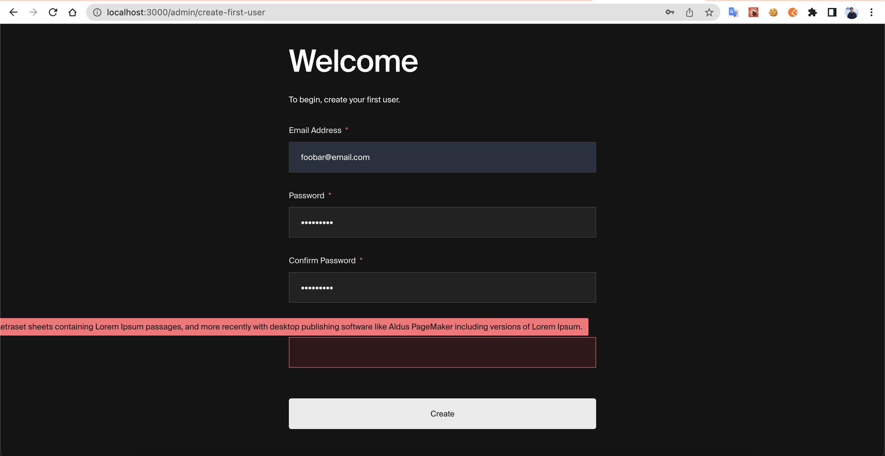
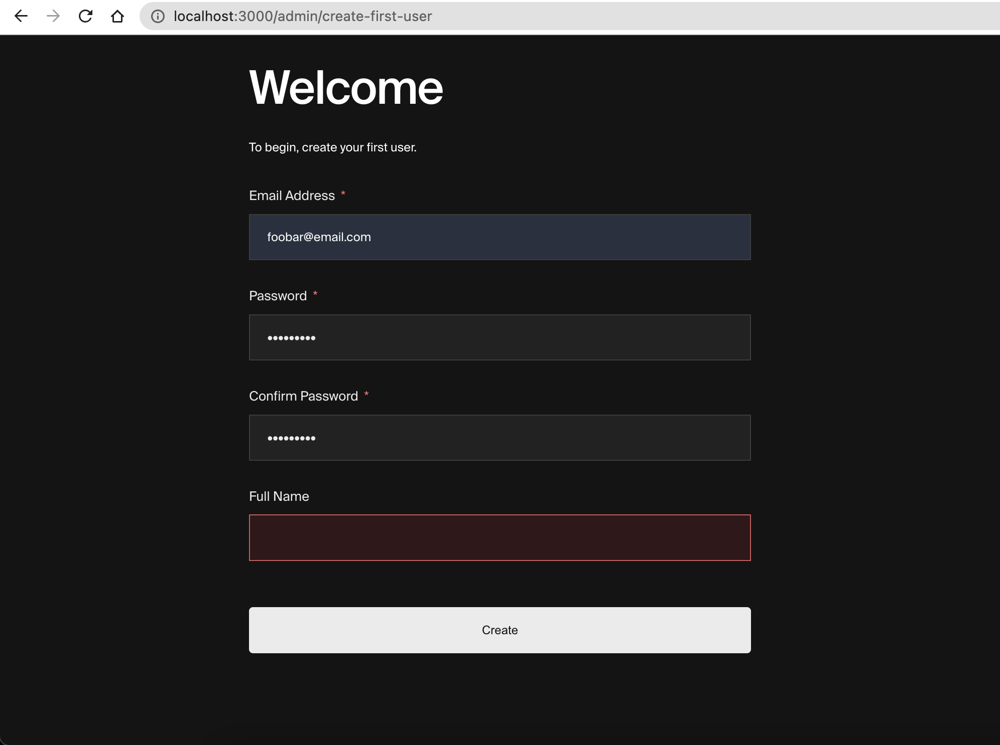

# Payload CMS Reproduce Field Validation Not Showing In Mobile Admin UI

# Reproduce Steps:

## Define a collection that has a field with a validation function that returns a very long string.

```ts
const Users: CollectionConfig = {
  slug: "users",
  auth: true,
  admin: {
    useAsTitle: "email",
  },
  fields: [
    {
      name: "fullName",
      type: "text",
      validate: () => {
        return `Lorem Ipsum is simply dummy text of the printing and typesetting industry. Lorem Ipsum has been the industry's standard dummy text ever since the 1500s, when an unknown printer took a galley of type and scrambled it to make a type specimen book. It has survived not only five centuries, but also the leap into electronic typesetting, remaining essentially unchanged. It was popularised in the 1960s with the release of Letraset sheets containing Lorem Ipsum passages, and more recently with desktop publishing software like Aldus PageMaker including versions of Lorem Ipsum.
    `;
      },
    },
  ],
};
```

## Expectation

In admin UI, when creating a user, the "fullName" field error will be visible to admin in mobile mode, and all characters of the string are visible.

## Actual

Bug 1: The long text does not wrap and thus some of the characters are cut off.



Bug 2: In mobile view, the error message does not show up at all.

